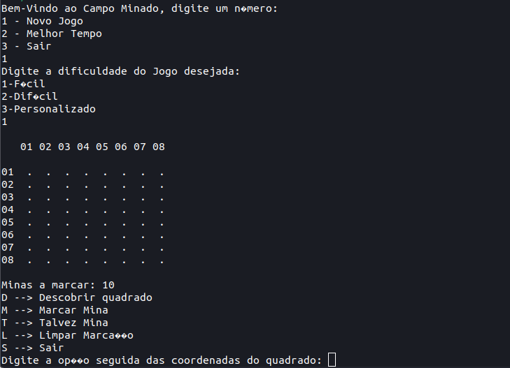

# Engenharia da Computação e Pós-graduação em Tecnologia da Informação - UFRN
Repositório para organizar todo o material produzido durante os cursos realizados na graduação de Engenharia de Computação e na pós-graduação de Tecnologia da Informação. Aqui está contido ordenadamente todos os repositórios das disciplinas, como também uma breve descrição de cada uma destas. Além disso, também é possível encontrar os meus artigos publicados durante minha passagem pela Universidade Federal do Rio Grande do Norte (UFRN).

<!-- 
 -->

    
<h2 align="center"> 
   📄 Artigos publicados 
</h2>
    

    <a href="https://github.com/isaaclyra132/programming-logical-project">
        Analysis of Teacher Training in Educational Robotics with URA Workshops
    </a>  

    - Coming soon...    

<h2 align="center"> 
    📚 Repositórios de cursos realizados
</h2>

<h3  align="center"> 
    <a href="https://github.com/isaaclyra132/programming-logical-project">
        Lógica de Programação    
        
    </a>  
</h3>

O curso de Lógica de programação é responsável por dar o primeiro contato do discente de Engenharia de Computação a programação. Dentre os conceitos estudados estão: Componentes do computador, Algoritmos, Variáveis e Expressões, Estruturas condicionais, Estruturas de repetição, HTML e CSS, Vetores e Funções. Todos esses conceitos foram abordados utilizando a linguagem de programação Javascript. O repositório da disciplina armazena o projeto final, que trata-se de uma aplicação web de um jogo de nave, onde foi utilizado a biblioteca p5.js para ser implementado.

    
<h3  align="center"> 
    <a href="https://github.com/isaaclyra132/programming-language"> 
        Linguagem de Programação    
        
    </a>  
</h3>

No curso de Linguagem de Programação é aprofundado todo o conteúdo abordado no curso anterior de Lógica de Programação. Aqui é estudado melhor Operadores, Expressões, Comandos de Entrada e Saída, Estruturas Condicionais e de Repetição, Funções, Vetores e Matrizes, Recursividade, Ordenação, Estruturas de Dados, Ponteiros. Todos esses conceitos foram abordados utilizando as linguagens de programação C/C++. O repositório armazena o projeto final, que trata-se de um jogo de campo minado que roda diretamente no terminal, onde foi implementado utilizando apenas a linguagem de programação C++.
    
    
<h3  align="center"> 
    <a href="https://github.com/isaaclyra132/advanced-programming"> 
        Programação Avançada    
        
    </a>  
</h3>  

No curso de Programação Avançada é dado foco no paradigma orientado a objetos. Dentre os conceitos abordados no curso, estão: Memória e armazenamento de dados (Ponteiros, Arrays, Alocação dinâmica de memória), Programação Orientada a Objetos (Classes, Construtores, Destrutores, Sobrecarga de operadores, Standard Template Libray, Herança, Polimorfismo), Programação Visual (Qt), Programação concorrente e distribuída, dentre outros. O repositório armazena listas, projetos implementados e referências utilizadas durante a disciplina. A disciplina foi ministrada inteiramente utilizando a linguagem de programação C++ e para a parte de programação visual foi utilizado o Qt Creator.

<h3  align="center"> 
    <a href="https://github.com/isaaclyra132/numerical-computation"> 
        Computação Numérica    
        
    </a>  
</h3>
    
No curso de Computação Numérica o foco principal é utilizar ferramentas computacionais para solucionar problemas matemáticos provenientes da modelagem de fenômenos das diversas áreas das ciências. Dentre os conceitos abordados no curso, temos: Representação em ponto flutuante, Expansão em série de Taylor, Resolução de Equações Transcendentais (Bisseção e Newton/Secante), Sistemas Linerares (Resolução Retroativa, Método de Gauss e Jacobi e Gauss-Seidel), Interpolação e Integração Numérica (Lagrange, Newton, Simpsom), Equações Diferenciais Ordinárias (Euler, RK2, RK4 e MMQ). O repositório armazena os algoritmos utilizados nos laboratórios e avaliações da disciplina. Durante a disciplina os algoritmos foram feitos utilizando o Scilab como alternativa open-source ao MATLAB.

    
<h3  align="center"> 
    <a href="https://github.com/isaaclyra132/digital-circuits"> 
        Circuitos Digitais    
        
    </a>  
</h3>

O curso de Circuitos Digitais é responsável por introduzir os conceitos principais do mundo dos circuitos digitais. Dentre os conceitos abordados no curso, temos: Álgebra booleana, Circuitos combinacionais e sequenciais, Máquinas de estado de baixo e alto nível, Projeto por transferência de registradores (RTL), Memórias, Projeto por Linguagem de Descrição de Hardware (HDL) e Projetos utilizando dispositivos lógicos programáveis. O repositório armazena todos os algoritmos dos laboratórios e projetos desenvolvidos na disciplina. Durante a disciplina os algoritmos foram feitos utilizando VHDL e os circuitos foram feitos utilizando o software Proteus.

<h3  align="center"> 
    <a href="https://github.com/isaaclyra132/digital-systems"> 
        Sistemas Digitais    
        
    </a>  
</h3>
    
No curso de Sistemas Digitais é aprofundado todos os conceitos visto primeiramente no curso de Circuitos Digitais. Aqui é estudado VHDL, Projetos de Controladores Digitais (MdE), Operadores digitais, Projetos de sistemas digitais a nível  de transferência de registros (RTL design), Técnicas de Otimização de projetos, Projeto baseado em dispositivos lógicos programáveis, Projeto de microprocessadores digitais, dentre outras coisas. O repositório armazena todos os projetos desenvolvidos durante a disciplina, bem como os relatórios dos mesmos. Durante a disciplina foi utilizado como microcontrolador o Atmega328P (utilizado no Arduino), a linguagem VHDL e também a linguagem de programação C.

<h3  align="center"> 
    <a href="https://github.com/isaaclyra132/computer-network"> 
        Redes de Computadores    
        
    </a>  
</h3>

O objetivo do curso de Redes de Computadores é aprecentar os principais conceitos relacionados ao tema e redes para automação industrial. No curso é estudado as redes de computadores, redes para automação industrial, comunicação de dados, arquitetura TCP/IP, protocolos e programação com sockets. O repositório armazena todos as práticas realizadas durante a disciplina. Durante o curso foi utilizado o Circo Packet Tracer e a linguagem de programação Python.

<h3  align="center"> 
    <a href="https://github.com/isaaclyra132/hardware-iot"> 
        Plataformas de Hardware para Internet das Coisas    
        
    </a>  
</h3>
    
No curso de Plataformas de Hardware para Internet das Coisas, como o próprio nome sugere, é estudado as plataformas de hardware mais utilizadas no contexto de IoT (arduino e ESP). Durante o curso é estudado conceitos básicos de eletrônica, uso de sensores e atuadores, protocolos de comunicação sem fio, programação para embarcados (C e Python). O repositório armazena todos as práticas desenvolvidas durante a disciplina. Durante o curso foi utilizado o devkit do Arduino e do ESP e as linguagens de programação Python e C.

    
<h3  align="center"> 
    <a href="https://github.com/isaaclyra132/data-structures-1"> 
        Algoritmos e Estrutura de Dados I    
        
    </a>  
</h3>
    
No curso de Algoritmos e Estrutura de Dados I é abordado os principais algoritmos da programação e também estruturas de dados. Durante o curso é estudado algoritmos de ordenação e de busca, estruturas de dados (lista, fila e pilha), árvores (binárias, busca, balanceadas), dentre outros assuntos. O repositório armazena todas as avaliações realizadas durante a disciplina, bem como os algoritmos desenvolvido em cada uma delas. A disciplina foi ministrada inteiramente utilizando a linguagem de programação C para implementação dos algoritmos e C++ para testes.

    
<h3  align="center"> 
    <a href="https://github.com/isaaclyra132/imd-gd-database">
        (PÓS-GRADUAÇÃO) Banco de Dados    
        
    </a>  
</h3>

Coming soon...

<!-- 
 -->
