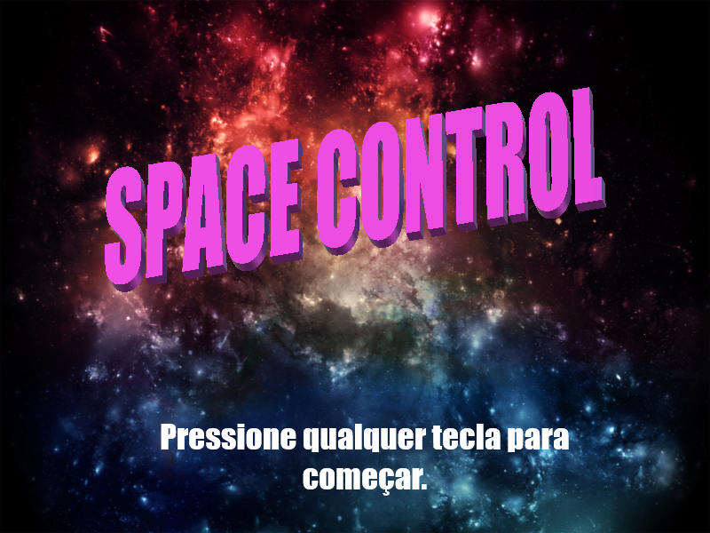

# Engenharia da Computação - UFRN
Repositório para guardar projetos feitos e arquivos utilizados durante a graduação em Engenharia da Computação da Universidade Federal do Rio Grande do Norte (UFRN).

## Artigos publicados

Lorem ipsum

## Repositórios de cursos realizados

### [Lógica de Programação](https://github.com/isaaclyra132/programming-logical-project)

O curso de Lógica de programação é responsável por dar o primeiro contato do discente de Engenharia de Computação a programação. Dentre os conceitos estudados estão: Componentes do computador, Algoritmos, Variáveis e Expressões, Estruturas condicionais, Estruturas de repetição, HTML e CSS, Vetores e Funções. Todos esses conceitos foram abordados utilizando a linguagem de programação Javascript. O repositório da disciplina armazena o projeto final, que trata-se de uma aplicação web de um jogo de nave, onde foi utilizado a biblioteca p5.js para ser implementado.

### [Linguagem de Programação]()

### [Programação Avançada]()

### [Computação Numérica]()
### [Redes de Computadores]()
### [Circuitos Digitais]()
### [Sistemas Digitais](https://google.com)
### [Dispositivos de Hardware para Internet das Coisas]()
### [Algoritmos e Estrutura de Dados I]()

